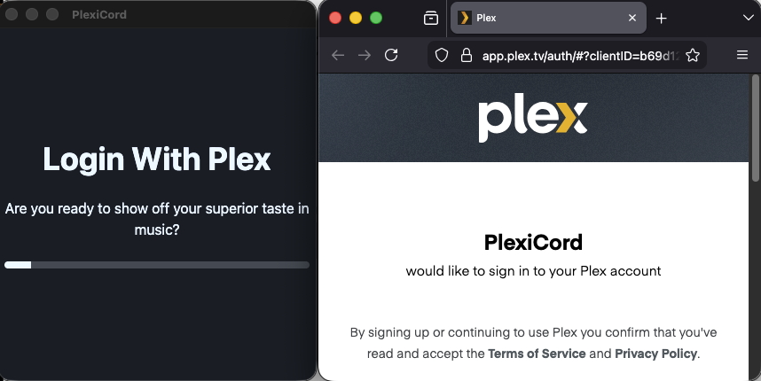
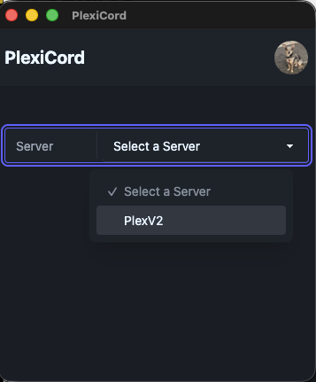
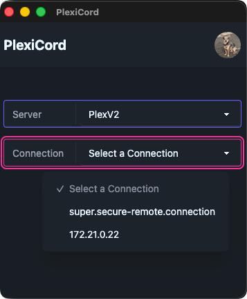
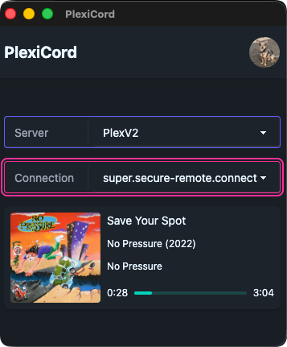
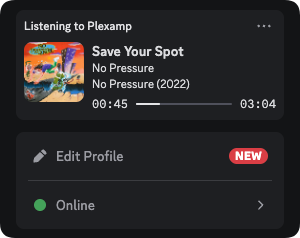
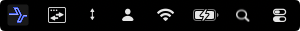

# PlexiCord


A crossplatform app for Discord Rich Presence integration with Plexamp

<div align="center">
  <h2>Powered By</h2>
  <a href="https://vuejs.org/">
    
  </a>
</div>
<div align="center">
  <a href="https://www.daisyui.com/">
    
  </a>
</div>
<div align="center">
  <a href="https://www.daisyui.com/">
    <picture width="450">
      <source media="(prefers-color-scheme: dark)" srcset="https://img.daisyui.com/images/daisyui/horizontal-dark.svg">
      <source media="(prefers-color-scheme: light)" srcset="https://img.daisyui.com/images/daisyui/horizontal-light.svg">
      
    </picture>
  </a>
</div>

## Inspiration

Please check out [Dyvinia's PlexampRPC](https://github.com/Dyvinia/PlexampRPC) as that is an even better solution if you use windows. From using [PlexampRPC](https://github.com/Dyvinia/PlexampRPC), I got addicted to showing off my superior music taste to all of my Discord friends and set out to create something that can work everywhere.

## Features

- Authenticate with Plex

  

  PlexiCord remembers you auth token and checks its validity everytime it starts up

- Select any of your owned servers to look for sessions (I plan to add support for non owned servers, in fact I think it's as easy as changing a filter in [plex.ts](src/lib/plex.ts#L25) perhaps you should submit a pull request!)

  

- Connect locally or remotely

  

- Show off them tunes!

  <div style="display: flex; align-items: flex-start;">
    
    
  </div>

- PlexiCord minimizes to your system tray (right click close to exit the application)
  

## Installation

PlexiCord is built as a dmg/exe so you can install it like any other application, but I've also packaged it as a .zip if you would just like to download it and run it from wherever you please.

## Building locally

If your platform doesn't have a build in the releases section, you can always build it yourself

``` bash
# clone this repo
git clone git@github.com:phishbacon/PlexiCord.git

# cd into the project directory
cd lyric-sync

# install dependencies
pnpm install

# make it!
pnpm make
```

The resulting artifacts will be in the ```out``` directory

## Contributing

PlexiCord is open source, it can be made better with contributors like you.

To get started developing,

``` bash
# clone this repo
git clone git@github.com:phishbacon/PlexiCord.git

# cd into the project directory
cd lyric-sync

# install dependencies
pnpm install

# start developing
pnpm start
```

and you should be up and running. Remember not to commit your ```plexicord.json``` file. It will have you auth token in it!

Feel free to open an issue or request a feature!

## Future features (maybe)

- Allow the user to configure the text displayed in Discord
- Allow the user to configure session polling/update intervals
- Allow non owned server selection
- Allow tray/dock configuration settings
- Make the UI better
- Verify linux build
- Perhaps store the token as a hashed value
